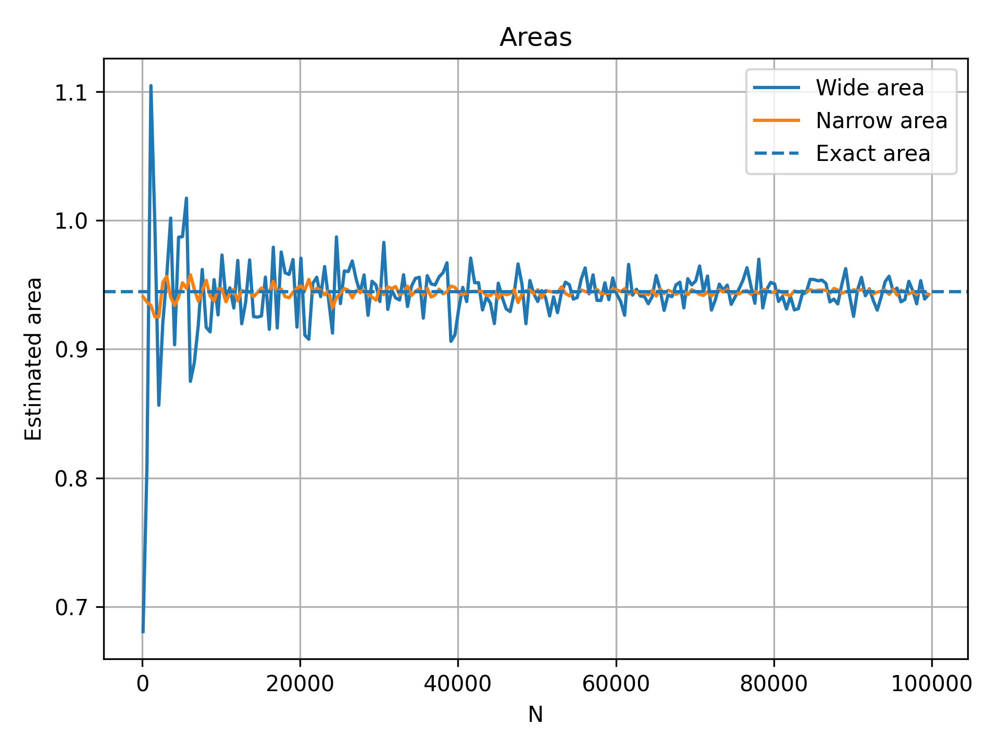
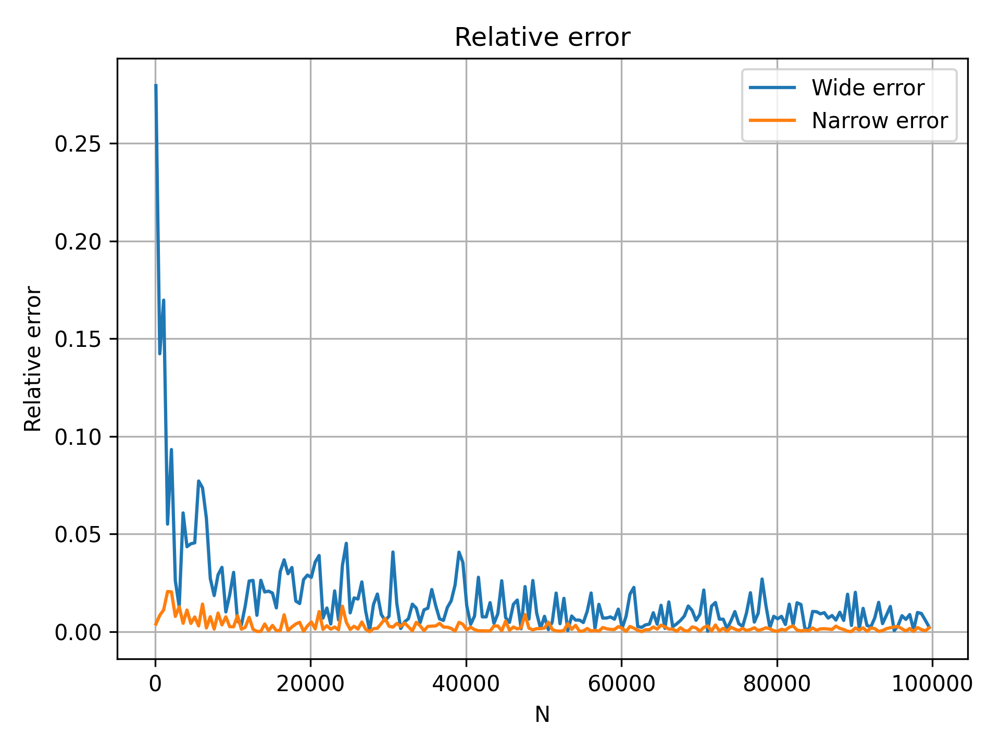

# Оценка площади пересечения трёх кругов методом Монте-Карло


### Идея метода Монте-Карло

1. Выбираем прямоугольную область с площадью S_rect, которая полностью содержит целевую фигуру.
2. Равномерно генерируем в этой области N случайных точек.
3. Считаем, сколько из них M попали внутрь пересечения трёх кругов.
4. Оценка площади: S ~= (M / N) * S_rect.

Относительная ошибка: epsilon = |S_approx - S_exact| / S_exact.

С увеличением N ошибка убывает примерно как O(1/sqrt(N)).

---

## Описание решения

### Структуры и функции

```cpp
struct Circle {
    double x, y, r;
};
```

- `Circle` — окружность с центром `(x, y)` и радиусом `r`.

```cpp
bool in_circle(double x, double y, const Circle& c);
bool in_intersec(double x, double y, const Circle& c1,
                 const Circle& c2, const Circle& c3);
```

- `in_circle` — проверяет, лежит ли точка внутри окружности.
- `in_intersec` — проверяет, лежит ли точка в **пересечении трёх** окружностей.

```cpp
double monte_carlo_area(const Circle& c1, const Circle& c2, const Circle& c3,
                        double min_x, double max_x,
                        double min_y, double max_y,
                        int total_points, mt19937& gen);
```

- `monte_carlo_area` — реализация метода Монте-Карло в заданном прямоугольнике.

### Области генерации точек

В программе используются две прямоугольные области:

1. **Широкая область** — минимальный осевой прямоугольник, содержащий все три круга:

```cpp
double wide_min_x = min({c1.x - c1.r, c2.x - c2.r, c3.x - c3.r});
double wide_max_x = max({c1.x + c1.r, c2.x + c2.r, c3.x + c3.r});
double wide_min_y = min({c1.y - c1.r, c2.y - c2.r, c3.y - c3.r});
double wide_max_y = max({c1.y + c1.r, c2.y + c2.r, c3.y + c3.r});
```

2. **Узкая область** — прямоугольник, плотно ограничивающий пересечение трёх кругов:

```cpp
double narrow_min_x = 0.88;
double narrow_max_x = 2.0;
double narrow_min_y = 0.88;
double narrow_max_y = 2.0;
```

Эти границы подобраны так, чтобы целевая фигура полностью помещалась внутри, но площадь прямоугольника была заметно меньше, чем у широкой области.

### Генерация данных

В `main` выполняется цикл по числу точек:

```cpp
for (int N = 100; N <= 100000; N += 500) {
    double S_wide   = monte_carlo_area(... wide_min_x, wide_max_x, ... N, gen);
    double S_narrow = monte_carlo_area(... narrow_min_x, narrow_max_x, ... N, gen);

    double err_wide   = fabs(S_wide   - S_exact) / S_exact;
    double err_narrow = fabs(S_narrow - S_exact) / S_exact;

}
```

Результаты сохраняются в файлы:

- `areas_results.csv` — приближённые площади:
  - `N,Wide_Area,Narrow_Area,Exact_Area`
- `errors_results.csv` — относительные ошибки:
  - `N,Wide_Relative_Error,Narrow_Relative_Error`

Дополнительно выполняется один прогон с `N = 1 000 000` для демонстрации высокой точности при большом числе точек.

---

## Результаты эксперимента

### 1. Приближённая площадь



- Оценки для обеих областей колеблются вокруг точного значения S_exact ≈ 0.9445.
- При малых N (100–1000) разброс большой, но с ростом количества точек колебания уменьшаются.
- Кривая для узкой области (оранжевая) заметно более «гладкая» и расположена ближе к пунктирной линии точной площади.

### 2. Относительная ошибка



- Для широкой области (синяя кривая) относительная ошибка вначале может достигать 20–30%, но затем быстро падает и при больших N составляет доли процента.
- Для узкой области (оранжевая кривая) ошибка на всём диапазоне N значительно меньше и быстро опускается до значений порядка 0.1–1%.
- В среднем:
  - средняя ошибка для широкой области ≈ 1.7%;
  - средняя ошибка для узкой области ≈ 0.26%.

---

## Выводы

1. Метод Монте-Карло корректно оценивает площадь пересечения трёх окружностей: при увеличении числа точек N приближённые значения сходятся к точному, а относительная ошибка убывает примерно как 1/sqrt(N).
2. Выбор прямоугольной области генерации точек существенно влияет на точность. Узкая область, более плотно охватывающая фигуру, значительно уменьшает дисперсию оценки и относительную ошибку при тех же значениях N.
3. При N = 1 000 000 относительная ошибка для широкой области составляет около 0.5%, тогда как для узкой — около 0.02%. Таким образом, узкая область позволяет получить более точный результат без увеличения числа генерируемых точек.


