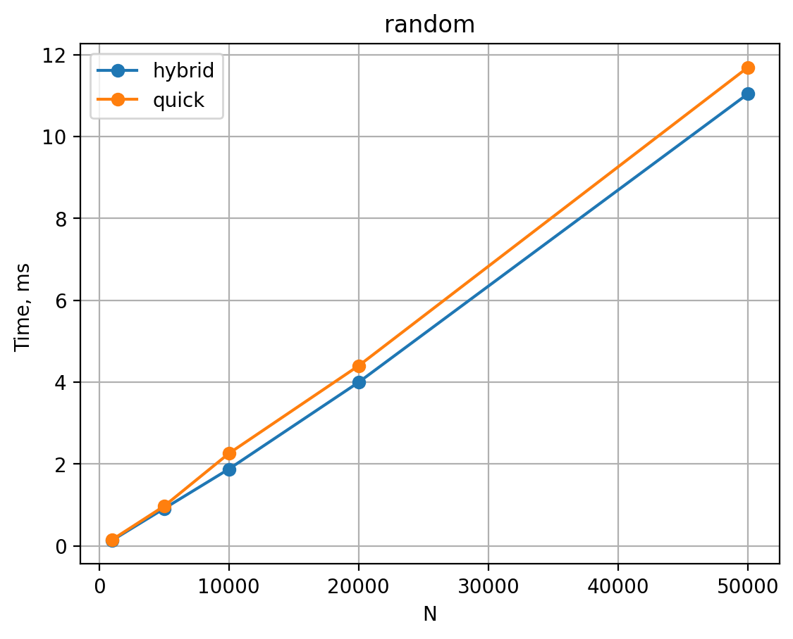
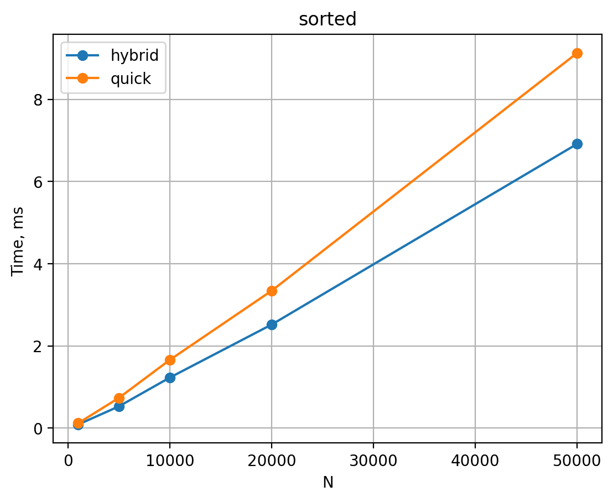
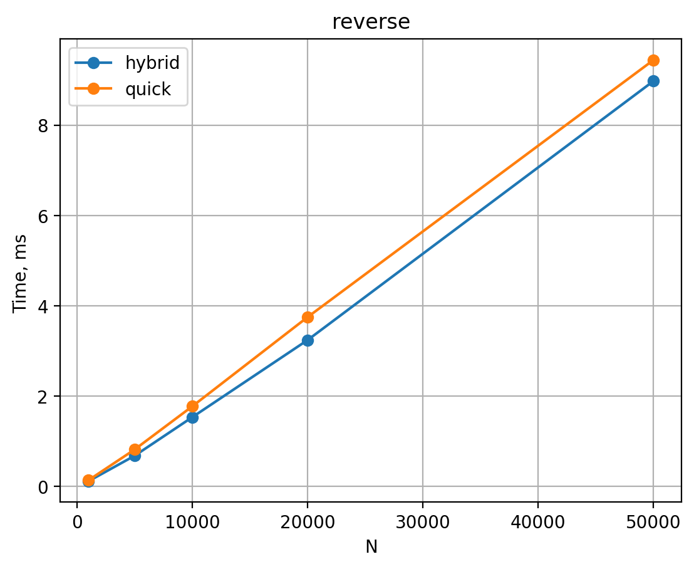

# Сравнение стандартного Quick Sort с Introsort 


## Реализация

### Стандартный QuickSort

- Ядро алгоритма — классический рекурсивный QuickSort.
- Опорный элемент выбирается **случайно** на отрезке `[left; right]`:

```cpp
uniform_int_distribution<int> dist(left, right);
int pivot_index = dist(rng);
swap(arr[pivot_index], arr[right]);
```

- После выбора опорного выполняется разбиение массива и рекурсивные вызовы для левой и правой частей.
- Средняя асимптотика — `O(N log N)`, но в худшем случае (неудачные опоры) возможен `O(N^2)` и глубокая рекурсия.

### Introsort

Используется гибрид QuickSort + HeapSort + InsertionSort. Реализована функция:

```cpp
void introsort(vector<int>& arr);
```

Внутри используется рекурсивная функция:

```cpp
void introsort_impl(vector<int>& arr, int left, int right, int depth_limit);
```

Где:

- `depth_limit = 2 * floor(log2(n))` — максимальная допустимая глубина рекурсии для массива размера `n`.

Логика работы `introsort_impl`:

1. Если в подмассиве `size < 16` элементов — используется **INSERTION SORT** по индексу от `left` до `right`.
2. Иначе, если `depth_limit == 0` — текущий подмассив сортируется **HEAP SORT** (на нём строится куча и выполняется HeapSort).
3. Иначе:
   - выбирается **случайный опорный элемент** (та же функция `part_rand`, что и в стандартном QuickSort);
   - рекурсивно вызывается `introsort_impl` для левой и правой частей, при этом `depth_limit` уменьшается на 1.

Таким образом:

- основная работа выполняется QuickSort с рандомной опорой (быстрый в среднем случае);
- при угрозе квадратичного худшего случая QuickSort обрывается и заменяется HeapSort;
- мелкие подмассивы обрабатываются оптимальным для них InsertionSort.

---


## Тестовые данные

1. **Случайные массивы** — элементы равномерно распределены в некотором диапазоне.
2. **Отсортированные массивы** — элементы массива отсортированы по неубыванию.
3. **Обратно отсортированные массивы** — элементы отсортированы по невозрастанию.

Размеры массивов :

```text
N = 1000, 5000, 10000, 20000, 50000
```

Для каждого `N` и каждой категории проводится по `k` повторов (в реализации — `repeats = 10`), после чего берётся **среднее** время работы алгоритма по всем повторам.

### Замер времени

Замеры выполняются с помощью `std::chrono::steady_clock` в наносекундах.  
Функции замера инкапсулированы в классе `SortTester`:

- `measure_quick_sort(vector<int> arr)`
- `measure_introsort(vector<int> arr)`

Каждый вызов получает **копию** исходного массива, чтобы оба алгоритма сортировали одинаковые данные.

---

## Результаты

###  Случайные массивы (`random`)



График показывает, что:

- обе реализации растут примерно как `O(N log N)`;
- кривые `quick` и `hybrid` лежат близко, но гибридная сортировка часто **немного быстрее**.

Это объясняется тем, что:

- в среднем QuickSort с рандомной опорой работает эффективно;
- переход на InsertionSort для малых подмассивов позволяет снизить накладные расходы на рекурсию;
- ограничение глубины рекурсии практически не срабатывает, но в редких случаях предотвращает слишком глубокие цепочки вызовов.

### Отсортированные массивы (`sorted`)



На уже отсортированных массивах:

- гибридная сортировка показывает **заметно лучшее** время по сравнению с классическим QuickSort;
- рост времени остаётся близким к `O(N log N)`.

Причины:

- для почти отсортированных подмассивов InsertionSort работает особенно быстро;
- при неудачных разбиениях QuickSort глубина рекурсии ограничивается, и на больших подмассивах срабатывает HeapSort, гарантирующий `O(N log N)`.

### Обратно отсортированные массивы (`reverse`)



Для обратно отсортированных массивов:

- обе реализации снова демонстрируют поведение `O(N log N)`;
- гибридная версия в среднем **чуть быстрее** стандартного QuickSort.

Здесь интросорт выигрывает за счёт:

- всё того же InsertionSort на малых кусках;
- защиты от глубокой рекурсии посредством HeapSort при достижении лимита глубины.

---

## Выводы

1. **Стандартный QuickSort** со случайным выбором опорного элемента демонстрирует хорошую среднюю производительность на всех типах данных, но сохраняет возможность квадратичного худшего случая и может порождать глубокий стек рекурсивных вызовов.

2. **Интросорт (Quick+Heap+Insertion)**:
   - использует QuickSort как основное ядро;
   - при чрезмерной глубине рекурсии ограничивает её и переходит на HeapSort, гарантируя `O(N log N)` во всех случаях;
   - применяет InsertionSort для небольших подмассивов, что уменьшает накладные расходы и ускоряет сортировку практически отсортированных данных.
   - на случайных массивах показывает время, сопоставимое со стандартным QuickSort, с небольшим преимуществом;
   - на отсортированных и обратно отсортированных массивах демонстрирует **более стабильное и часто меньшее** время работы благодаря ограничению глубины рекурсии и использованию InsertionSort.

